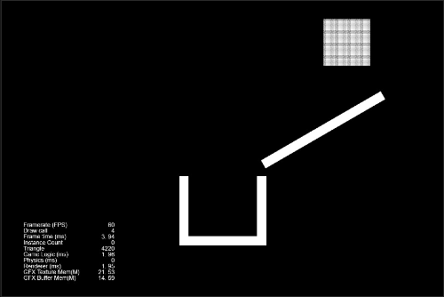

# cocos-creator-liquid

[LiquidFun](https://google.github.io/liquidfun/) API demo for [Cocos Creator v3.5.0](https://www.cocos.com/en/creator).

<div align="center">
  
</div>

There are some awesome demos like below, but they are not type-safe or outdated, so I created type-safe one on Cocos Creator v3.5.0.

- https://github.com/cocos/cocos-awesome-tech-solutions/blob/3.4.0-release/demo/Creator3.4.0_2D_Fluids/assets/render.ts
- https://github.com/baiyuwubing/cocos-creator-examples/blob/master/2.4.x/assets/demo03/LiquidBox2dTest.ts

## What I did for type-safety.

### Install [@cocos/box2d](https://www.npmjs.com/package/@cocos/box2d/v/1.0.0) as npm package

Once we could refer RequidFun API types via global `b2` object, but now can't, so I did

```sh
$ npm install @cocos/box2d
```

### Configure Import Map

Created `import-map.json` as followings,

```json
{
  "imports": {
    "@cocos/box2d/src/box2d": "./node_modules/@cocos/box2d/build/box2d/box2d.umd.js"
  }
}
```

and set it as `Import Map` on Cocos Creator (Project > Project Settings > Scripting).

<div align="center">
  
</div>

### Do a tricky import

Everything in box2d.umd.js seems exported as default, so I needed a tricky import like below, and now everything can be referred via `b2` as before.

```ts
// followings and import-map.json are very dirty hack to refer hidden types such as b2ParticleSystem.
import * as b2 from "@cocos/box2d/src/box2d";
// @ts-ignore
b2 = b2.default;
```

### Do an unsafe cast

`PhysicsSystem2D.instance.physicsWorld.impl` is `any`, but actually b2World instance who has `CreateParticleSystem()` method, so I did a unsafe cast just once.

```ts
// cast just once for type safety
const world = PhysicsSystem2D.instance.physicsWorld.impl as b2.b2World;
```
